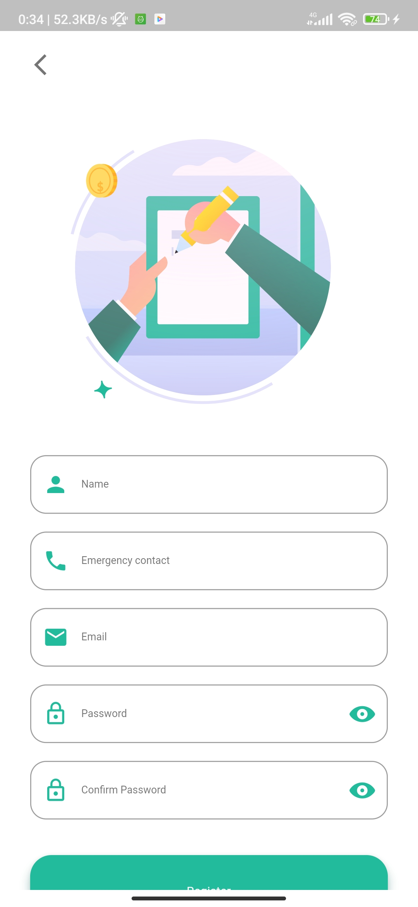
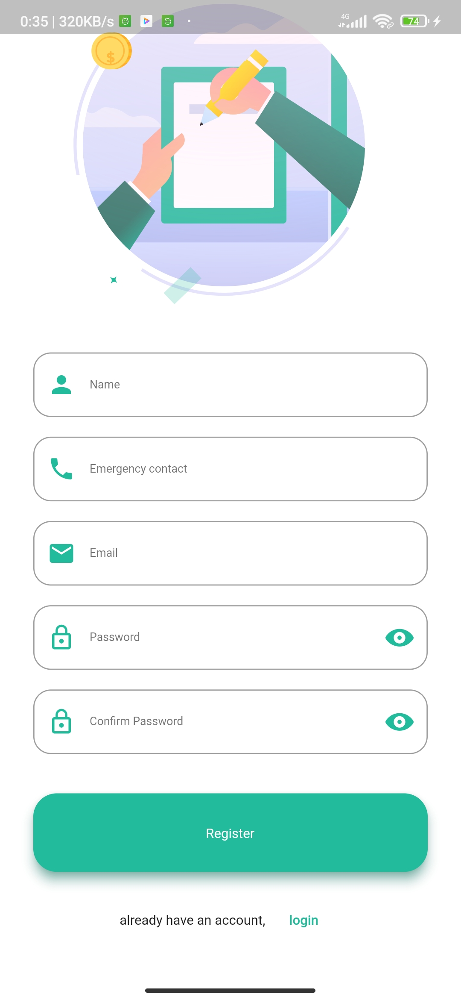
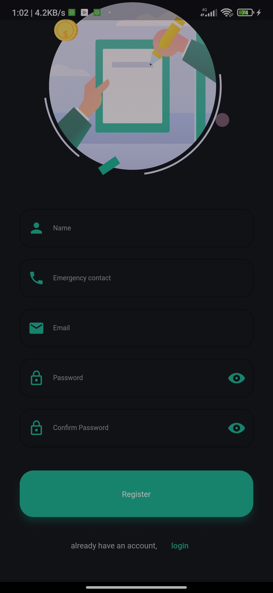
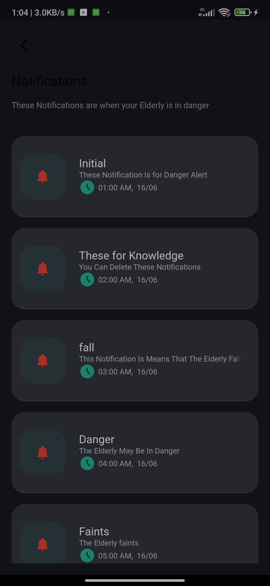
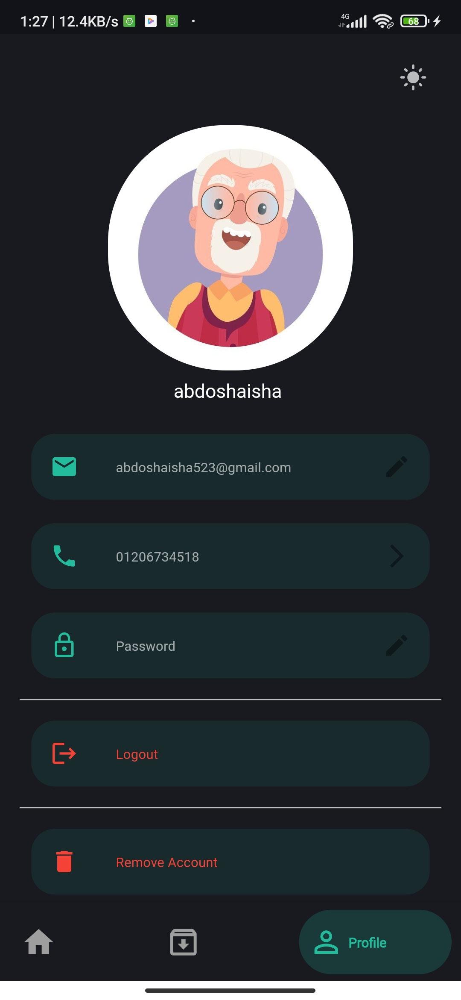
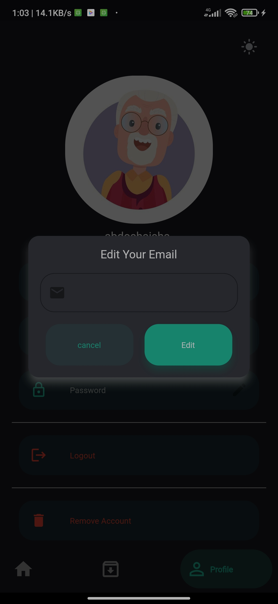

# app2m

A new Flutter project.

## Getting Started

This project is a starting point for a Flutter application.

This is for My Graduation Project and is the Abstract.

`Elderly people have an increased risk of chronic diseases. They are more prone to falls, 
accidents, and health problems. Actually, falls are one of the leading causes of injuries 
that require hospitalization. Therefore, it is important to be aware of the risks that can 
affect them and to take some steps to protect them from harm. Our project also shows 
some other problems facing elderlies, including chronic diseases, social isolation, and 
medication management, which negatively affect their health. To solve these problems, 
automatic fall detection systems are used to monitor elderlies and patients in homes and 
hospitals. The accuracy of fall detection can be improved using computer vision 
techniques, especially when taking advantage of deep learning and extracting useful 
features for the detected person. Our project aims to work as follows When elderlies 
are detected falling, their supervisor is alerted using a mobile application created 
specifically to help elderlies manage their medication and doctor’s appointments.`

## Features:

- manage his dates with medications or doctors.
- can archive or delete any date in his list
- receiving 3 types of Notifications,
- for his Date with the doctor or medications,
- for a dangerous thing has happened to an Elderly person,
- or to remember him to call someone to minimize the social isolation
- can add an Emergency contact, and there are some more.

________________________________________________________

- Flutter / Dart
- Beautiful Ui
- Animations
- Simple for Using
- Rest APIs
- Firebase
- Notifications
- Theme
- Shared preferences
- State Management (Provider)
- clean code

#### Screenshots

##### Light
         
         
       

##### Dark
             

________________________________________________________________________
